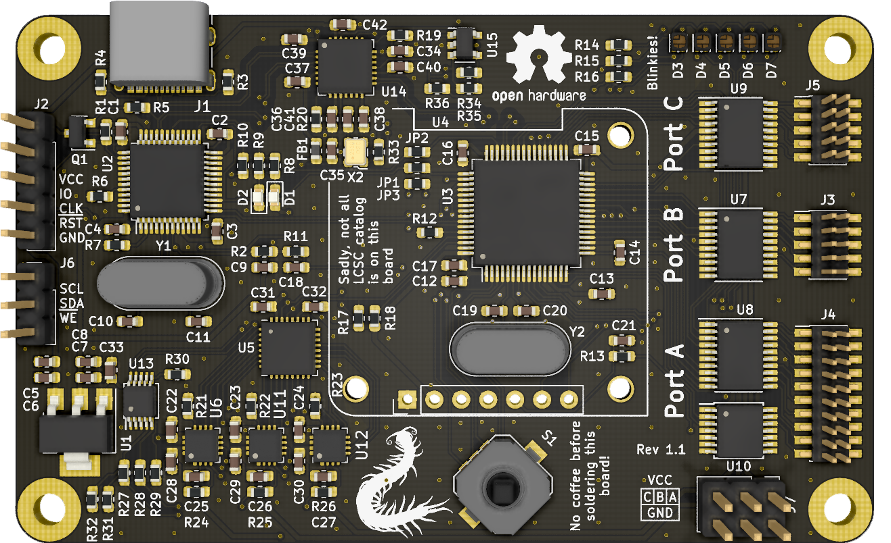

# Antboard

An STM32 dev board with 1.27mm headers for GPIOs that got a bit over the top.
Yeah this is a kitchen sink board now...

## Features

* STM32F205 microcontroller
* 3 independant IO banks routed to 1.27mm headers (1x 10 IO, 2x 5 IO)
  - bidirectional level shifter
  - shifter supply voltage controllable through software
* accepts IDC ribbon cables
* integrated ST-LINK/V2 probe (compatible with BlackMagic firmware)
* integrated USB hub for both JTAG and user USB
* integrated ADC to control set bank voltages
* OLED screen
* joystick
* 5 RGB LEDs, just because blinkies

All components can be sourced on the usual distributors, and for cheap on LCSC.
